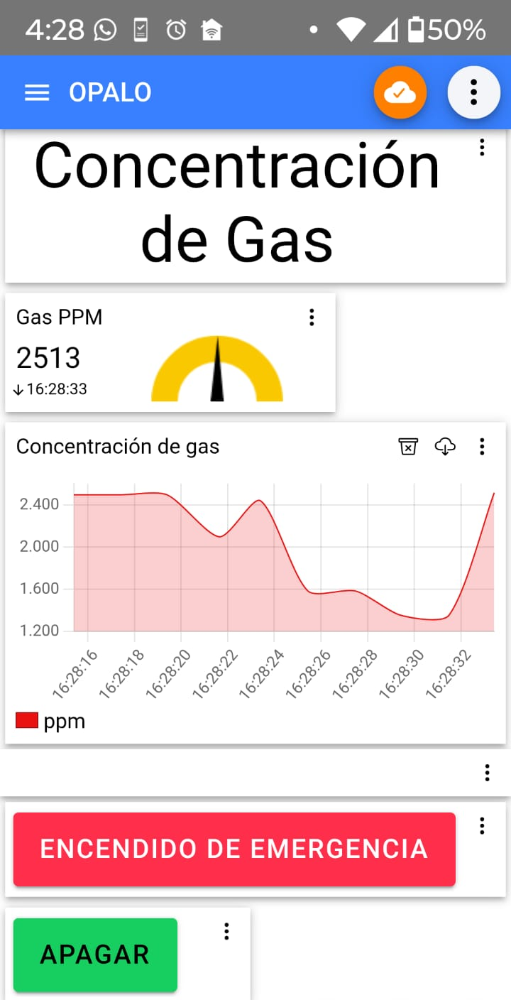
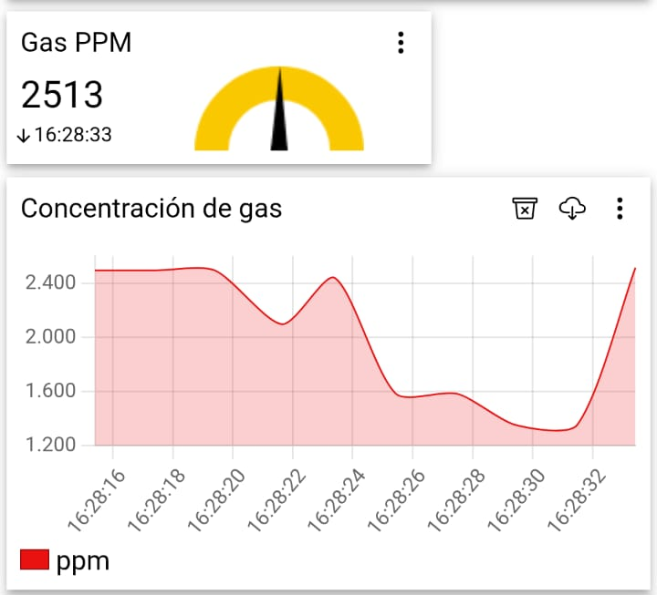
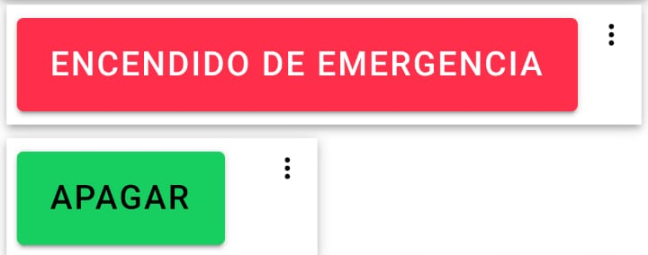

# Control Manual del Ventilador para Mitigación de Riesgos

La aplicación Android permite el **control manual del ventilador** en situaciones de emergencia, especialmente en entornos con **altas concentraciones de gas**. Al encenderse, el ventilador **aumenta el flujo de aire** y ayuda a reducir la concentración de gas, mitigando posibles riesgos.

---

## Comunicación entre ESP32 y la Aplicación

El **ESP32** se encarga de:

- **Publicar** los datos del sensor de gas **MQ2** (en partes por millón, PPM) a un **broker MQTT**.
- **Recibir comandos** (`ON/OFF`) desde la aplicación para activar o desactivar el ventilador.

---

## Funcionalidades de la Aplicación Android (IoT MQTT Panel)

- Visualización en tiempo real de la concentración de gas mediante gráficos.
- Panel de control manual con botones para encender o apagar los ventiladores.

---

## Detalle del Funcionamiento

### Publicación de datos (ESP32 → Broker MQTT)

El ESP32 **publica** los valores del sensor MQ2 en el tópico MQTT:  
`[nombre_del_tópico]`  
*(El nombre debe coincidir con el utilizado en el código del ESP32).*

### Visualización en la App

La aplicación, suscrita al tópico, **muestra los datos en un gráfico en tiempo real**, por ejemplo, los **últimos 10 valores recibidos**.

### Control manual desde la App

- **Botón “ENCENDER”** (color rojo):
  - Envía el comando **`ON`** al tópico.
  - El ESP32 activa los ventiladores al **100% de capacidad**.

- **Botón “APAGAR”** (color verde):
  - Envía el comando **`OFF`** al mismo tópico.
  - El ESP32 **detiene inmediatamente** los ventiladores (función de parada de emergencia).

---

## Dashboard en la Aplicación Android

### Gráfico de Concentración de Gas

- Muestra el historial de valores en PPM (por ejemplo, de 1.500 a 4.000).
- **Eje X**: marcas de tiempo (horas).
- **Eje Y**: escala en partes por millón (PPM).

### Panel de Control Manual

- Botones grandes:
  - **ENCENDER** (rojo)
  - **APAGAR** (verde)
- Diseñados para una activación rápida en caso de emergencia.

---

